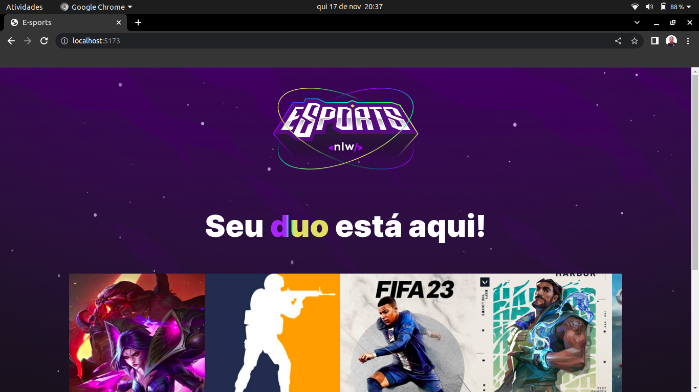
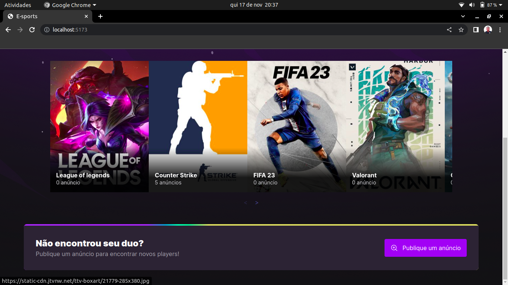
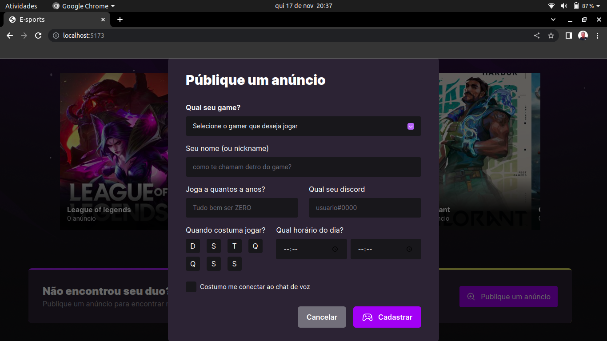

# E-SPORTS;

## Começando.

Olá, no projeto E-sports você pode ver várias opções de jogos mais jogados no momento. Além disso, você pode adicionar quantos anúncios você quiser nós jogos que estão disponiveis!

### 📋 Pré-requisitos

Para você rodar o projeto em sua maquina local você necessita ter essas tecnologias já instaladas ou você pode instalar:

- NodeJs: você pode instalar o node ([clicando aqui](https://nodejs.org/en/download/)).

- Yarn: você pode instalar o yarn ([clicando aqui](https://classic.yarnpkg.com/lang/en/docs/install/#debian-stable)).

## Executando o projeto em seu ambiente de desenvolvimento

Primerio você precisa instalar as depências com o comando:

```
yarn install
```

Em seguida execute o comando para inicializar o projeto:

```
yarn run dev
```

<br>
Após executar o comando yarn run dev, você pode acessar o site na sua porta local!
<br><br>

A tela inicial do site! Aqui está os jogos, você pode passar o carrossel para o lado e ver os todos jogos. Se você clicar em algum jogo vai mostrar somente a imagem do jogo. Além disso, você pode publicar um anúncio!
<br>

Tela inicial do site!
<br><br>


<br><br>

Aqui você pode publicar um anúncio!
<br><br>


<br><br>

O modal para publicacão do anúncio!
<br><br>


<br><br>

Pronto, essa foi uma breve demostração do site, pode ficar a vontade para modificá-lo, fazer melhorias, etc.

## 🛠️ Tecnologias utilizadas.

- [NodeJS](https://nodejs.org/en/about/) - É uma tecnologia open-source(código aberto) e multiplataforma que permite criar ferramentas ao lado do servidor(backend) com javaScript.

- [TypeScript](https://www.typescriptlang.org/) - É uma tecnologia desenvolvida pela microsoft, é um superSet do javaScript que permite utilizar tipagem estática facilitando a escrita do código.

- [CORS](https://www.npmjs.com/package/cors) - CORS é um mecanismo que bloquea front-ends que não têm permições para acessar nossa API.

- [Express](https://expressjs.com/pt-br/) - Express é um fremework web que é utilizado em conjunto ao NodeJs. O express facilita muito no gerenciamento das nossas rotas, gerenciamento das requisições HTTP e muito mais!

- [Bcryptjs](https://www.npmjs.com/package/bcryptjs) - O bcryptjs é uma biblioteca para encriptação de dados. Estou utilizando essa biblioteca para encriptografa a senha do usuário.

- [Yup](https://www.npmjs.com/package/yup) - O yup é um construtor de esquemas para validação de campos, por exemplo, um formulário. Estou utilizando ele para
  validar os dados na criação do usuário.

## ✒️ Autor

- [Mateus](https://github.com/mateusfelixdias).

## Agredecimentos

@ROCKETSEAT
