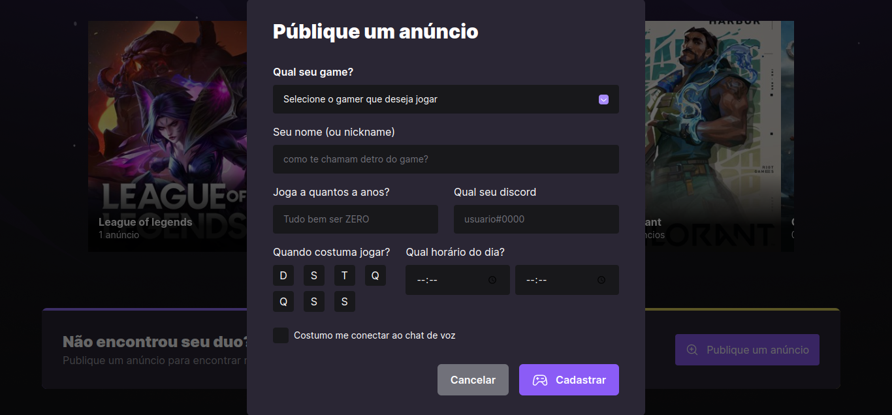

# E-SPORTS;

## Começando.

Olá, no projeto E-sports você pode ver várias opções de jogos mais jogados no momento. Além disso, você pode adicionar quantos anúncios você quiser nos jogos que estão disponiveis!

### 📋 Pré-requisitos

Para você rodar o projeto em sua maquina local você necessita ter essas tecnologias já instaladas ou você pode instalar:

- NodeJs: você pode instalar o node ([clicando aqui](https://nodejs.org/en/download/)).

- Yarn: você pode instalar o yarn ([clicando aqui](https://classic.yarnpkg.com/lang/en/docs/install/#debian-stable)).

## Executando o projeto em seu ambiente de desenvolvimento

Primerio você precisa instalar as depências com o comando:

```
yarn install
```

Em seguida execute o comando para inicializar o projeto:

```
yarn run dev
```

<br>
Após executar o comando yarn run dev, você pode acessar o site na sua porta local!
<br><br>

A tela inicial do site! Aqui está os jogos, você pode passar o carrossel para o lado e ver todos jogos. Se você clicar em algum jogo vai mostrar somente a imagem do jogo. Além disso, você pode publicar um anúncio!
<br>

Tela inicial do site!
<br><br>


<br><br>

O modal para publicacão de um anúncio!
<br><br>


<br><br>

Pronto, essa foi uma breve demostração do site, pode ficar a vontade para modificá-lo, fazer melhorias, etc.

## 🛠️ Tecnologias utilizadas no frontend.

- [Axios](https://axios-http.com/ptbr/docs/intro) - É um cliente HTTP baseado em promisses, com o axios você pode fazer requisições HTTP com muito mais facilidade. Além disso, o axios pode ser utilizado tanto no lado do frontend, quanto no lado do backend.

- [Classnames](https://www.npmjs.com/package/classnames) - É um utilitário JavaScript simples para unir classnames condicionalmente. Com classnames você pode fazer condicionais no seu código de estilização.

- [TypeScript](https://www.typescriptlang.org/) - É uma tecnologia desenvolvida pela microsoft, é um superSet do javaScript que permite utilizar tipagem estática facilitando a escrita do código.

- [Tailwindcss](https://tailwindcss.com/) - É um framework que permite escrever CSS de um jeito diferente, a sua principal característica é fornecer classes utilitárias para podermos escrever CSS em nossos arquivos de marcação jsx, tsx, por exemplo.

- [Vite](https://vitejs.dev/) - É uma ferramenta de contrução que pode ser utilizada com a maioria das estruturas web, como ReactJs, VueJs, entre outras. O vite é uma exelente ferranta que trás mais performace para o seu app. O vite foi criado pelo mesmo criado do vueJs, o evan you.

- [Yup](https://www.npmjs.com/package/yup) - O yup é um construtor de esquemas para validação de campos, por exemplo, um formulário. Estou utilizando ele para
  validar os dados na criação de um anúncio.

## 🛠️ Tecnologias utilizadas no backend.

- [NodeJS](https://nodejs.org/en/about/) - É uma tecnologia open-source(código aberto) e multiplataforma que permite criar ferramentas ao lado do servidor(backend) com javaScript.

- [TypeScript](https://www.typescriptlang.org/) - É uma tecnologia desenvolvida pela microsoft, é um superSet do javaScript que permite utilizar tipagem estática facilitando a escrita do código.

- [CORS](https://www.npmjs.com/package/cors) - CORS é um mecanismo que bloquea frontends que não têm permições para acessar nossa API.

- [Express](https://expressjs.com/pt-br/) - Express é um fremework web que é utilizado em conjunto ao NodeJs. O express facilita muito no gerenciamento das nossas rotas, gerenciamento das requisições HTTP e muito mais!

- [Yup](https://www.npmjs.com/package/yup) - O yup é um construtor de esquemas para validação de campos, por exemplo, um formulário. Estou utilizando ele para
  validar os dados na criação de um anúncio.

## ✒️ Autor

- [Mateus](https://github.com/mateusfelixdias).
